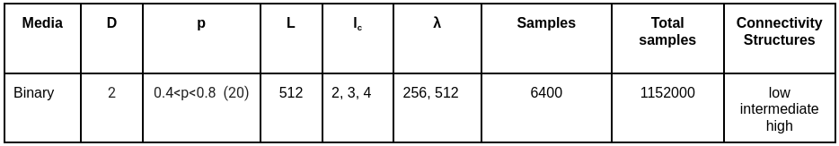

# Predicting equivalent hydraulic conductivity (_Keq_) of synthetic reservoirs using machine learning techniques

This project aims to develop machine learning models for predicting _Keq_ based on 2D geometric connectivity indicators. The project includes various models, data preprocessing steps, and evaluation metrics to ensure robust predictions.

## **1 - Introduction**
Reservoir engineering uses numerical simulation to model and predict the behavior of fluids in a reservoir over time. It involves the creation of mathematical and computational models that represent the geological and fluid dynamic properties of the reservoir rock. These models are based on geological data, geophysical surveys, laboratory tests, well tests, production histories, among other sources of information, and allow for the simulation of how fluids move in the Earth's subsurface, as well as how they can be extracted or injected to or from the surface (Steve 2018). This discipline has applications in the energy sector, such as oil and gas extraction, geothermal energy production, groundwater production, underground contaminant transport, and carbon dioxide capture and storage (CCUS).

These models are used to construct maps composed of cells that characterize the reservoir at high-resolution scales. Because simulations at these scales require extensive computational resources, an upscaling procedure is necessary to transfer the petrophysical properties and characteristics of the high-resolution fine grid to a low-resolution simulation grid.

**Fig. 1** shows maps of the logarithm of point hydraulic conductivity, log(*k(**r**)*), as a function of coordinates in two-dimensional space. The map on the left is represented on a fine-grid scale whose petrophysical properties, such as point hydraulic conductivity *k(**r**)*, are sampled with high spatial resolution. The upscaling procedure allows the petrophysical properties to be transferred to a simulation map or coarse grid (map on the right) where the characteristic values ​​of the equivalent hydraulic conductivity *Keq* are distributed with a reduction in spatial resolution. This allows simulations and calculations to be carried out with acceptable computational requirements. The homogenization procedure that allows a representative *Keq* value to be determined for a given block, based on the *k(**r**)* values, is called 'upscaling'.

**Fig. 1:** Spatial scales used in upscaling procedures. The map on the left, with linear size *L*=256*Δ*, defines the point values ​​of hydraulic conductivity *k(**r**)* on the fine grid with linear cell size *Δ* (this length is given by the image pixel size). The integral scale or correlation length *lc*=16*Δ* provides the characteristic length scale of the heterogeneity. After upscaling, the equivalent hydraulic conductivity Keq is defined on each block of the coarse grid with linear cell size *λ*=32*Δ*.

In each reservoir realization or sample, *k(**r**)* is considered a random process characterized by a probability density function P[*log*(*k(**r**)*)], and the spatial variation of *k(**r**)* is defined by a covariance function with a certain integral length scale lc. The realizations can then be conditioned on the available field data. In lognormal or multi-Gaussian media, the mean and variance of P[*log*(*k(**r**)*)] may be sufficient to determine Keq (De Wit, 1995; Colecchio et al., 2020). However, in certain scenarios, for example if there are tortuous channels where preferential flows are manifested, it has been shown (Western et al., 2001) that additional information on the spatial organization of *k(**r**)* is required. Zinn and Harvey (2003) and Jankovic et al. (2016) modified continuous multi-Gaussian fields in which *k(**r**)* classes or facies with intermediate values ​​are connected, while *k(**r**)* classes with extreme values ​​are disconnected, by applying a Normal Score Transform (NST) to exchange the intermediate *k(**r**)* classes with the high (low) *k(**r**)* classes. This allows increasing (decreasing) the connectivity of the high (low) *k(**r**)* classes without modifying P[*log*(*k(**r**)*)] or the spatial covariance function. The different connectivity structures can be observed in **Fig. 2**: high, intermediate and low.

 **Fig. 2:** Mpas of *log*(*k(**r**)*) of the connectivity structures used in this study: (left) high, (center) intermediate, and (right) low connectivity structures. A zoom is shown in the lower left corner for better visualization.

Another approach to assess and measure the connectivity of different *k(**r**)* classes is to analyze how different **connectivity metrics** or **indicators** correlate with _Keq_. Media with discrete distributions of *k(**r**)* classes have been used, such as **binary media**, which are a simplified representation of two facies (Knudby et al., 2006; Colecchio et al., 2021) characterized by a proportion *p* of high-conductivity facies *k(**r**)*  = *k+* = constant and a proportion (*1*−*p*) of low-conductivity facies *k(**r**)*  = *k-* = constant. These media allow the characteristics of geometric heterogeneity to be retained, allowing the parameter space to be more manageable (Hunt and Idriss, 2009; Colechio et al., 2021). Furthermore, binary media can accurately model natural formations, such as sandstone-shale or sand-clay underground formations (Guin and Ritzi, 2008). 

Connectivity analysis based on connectivity metrics or indicators has direct application in binary media. Some of these indicators are defined as the average distance (in the flow direction) between inclusions of high hydraulic conductivity classes within a low hydraulic conductivity medium. Renard (2013) used an indicator based on the average ratio of the area to convexity of clusters of different geometry and connectivity for binary media. The indicators discussed in this work come from percolation theory and integral geometry. They are statistical indicators that quantify, for example, the cluster distribution (size and number) of high *k(**r**)* classes, or the ratio of the volume of the largest cluster to the total volume of high *k(**r**)* facies or classes, or the ratio of cell pairs with connected *k(**r**)* classes to all permeable cell pairs. In section 3, Methodology, the explanation and implementation of binary media and connectivity indicators is extended.

In recent years, due to technological advances in computer science, such as increased processing and storage capacity, cloud computing, and increased graphics processing capacity, among others, machine learning (ML) and deep learning (DL) algorithms have gained popularity in all areas of science (Moghaddam et al., 2023). Specifically, in hydrogeology, a discipline related to the petroleum industry, there are several studies using ML and DL techniques to address the problem of flow through porous media (Wang et al., 2020; Tartakovsky et al., 2020).

This work proposes the implementation of different machine learning algorithms to predict equivalent hydraulic conductivity (_Keq_) in upscaling procedures based on different connectivity metrics or indicators.

## **2 - Objectives**
### **2.1 - Main objective**
Implement machine learning algorithms to optimize the derivation of effective reservoir parameters, such as equivalent hydraulic conductivity (_Keq_), in upscaling procedures.

### **2.2 - Specific objectives**
  - Analyze and study the possibility of implementing different machine learning algorithms to optimize upscaling procedures for obtaining _Keq_ from connectivity indicators using 2D synthetic media or reservoirs with a global grid size of *L*=5122.
    
  - Use different synthetic reservoir construction parameters to generate different media or sample realizations. It is proposed to vary the correlation length (__*lc*__) and connectivity structures: intermediate, high, and low (see Table 1).
    
  - Evaluate and analyze the performance of the following machine learning algorithms in predicting _Keq_.
    
    - Extreme gradient boosting (XGBoost).
    - Artificial Neural Networks (ANN): Keras Neural Network.
    - Decision Tree (DT).
    - Generalized Linear Model (GLM): Tweedie Regressor.
    - Elastic Net Linear Model.

## **3 - Methodology**
The first step consisted of generating samples or realizations of two-dimensional (2D) square binary media. The media are characterized by three parameters: connectivity structure (low, intermediate, high), an integral scale __*lc*__, and a ratio __*p*__. The scale was then scaled from the fine scale (*Δ*) through various intermediate scales (*λ*) to the media size (*L*), obtaining a __*Keq*__ value for each sample or realization. The complete procedure for generating synthetic media or reservoirs is detailed below.

  **a.** Generation of 2D multi-Gaussian media realizations of linear size (*Lx*=*Ly*=512*Δ*) with a unit cell size of *Δ*=1 m, with a lognormal distribution of *k(**r**)*, using an isotropic exponential covariance function. The samples were characterized with __*lc*__ = 2, 3, 4. In the stochastic framework employed, 6400 realizations were generated for each set of parameters, achieving a total of 1152000 realizations in order to achieve good statistical sampling (see Table 1).

                                               
  **Table 1:** Construction parameters of synthetic reservoirs and simulator input data.  

In multi-Gaussian media, the intermediate *k(**r**)* classes form a connected matrix, while the *k(**r**)* classes are disconnected. Random fields were generated using the fast Fourier transform moving average (FFT-MA) method.

  **b**. Truncation binarization, mapping the *k(**r**)* point values ​​of the multi-Gaussian samples to __*k+* = 100 mD__ and __*k-* = 0.01 mD__ point values ​​in the target binary samples. The truncation scheme shown in **Fig. 3** was used to generate the binary media samples with high, intermediate, and low connectivity structure types (**Fig. 2**). The following range of the proportion p of high hydraulic conductivity facies was used: **0.4 <= _p_ <= 0.8**, **20** values.

                                              
  **Fig. 3:** Schematic of the truncation procedure used to obtain binary samples from multi-Gaussians with high (left), intermediate (center), and low (right) connectivity structures. Note that in the underlying multi-Gaussian samples, intermediate values ​​of *k(**r**)* form a connected matrix (CM), while extreme values ​​form a disconnected matrix (DM) (Colecchio et al., 2021).. 

  **c.** Calculation of connectivity metrics or indicators using the Connect3D code derived from percolation theory and integral geometry. The indicators used are listed below: VOLALE, GAMMA, ZNCC, SPANNING, npx, npy, npz, PPHA, Plen, S, X.

  **d.** Calculation of the equivalent hydraulic conductivity _Keq_: This is the most computationally expensive phase. To obtain _Keq_, the Darcy equation (Eq. 1) is applied, where the flow is solved by imposing a hydraulic gradient between the inlet (**Hin**) and outlet (**Hout**) faces (Dirichlet boundary conditions). In **Eq. 1**, q is the mean flow velocity through a plane perpendicular to the hydraulic gradient                    
(**Hin** **-** **Hout** **/** **L**) . Furthermore, the faces of the domain parallel to the flow are considered to be impermeable and therefore there is no flow through them (Neumann boundary conditions).

$$
 K_{eq} = \frac{qL}{H_{in}-H_{out}} \hspace{2cm} \text{(**Eq. 1**)}
$$

The flow is calculated across the entire domain, i.e., using global upscaling, obtaining a single Keq value for each medium or implementation.

The generation of synthetic reservoirs, flow resolution, and training of machine learning algorithms were performed on the TUPAC high-performance computing (HPC) cluster at CONICET's Center for Computational Simulation for Technological Applications. This cluster is a supercomputer with high processing and storage capacity, composed of 60 CPU nodes (Dell PowerEdge C6145) with 64 cores each and 120 GB of RAM, plus 8 GPU nodes (Nvidia RTX 2080), and a total of 72 TB of storage (https://www.tupac.gob.ar/stories/home/).
